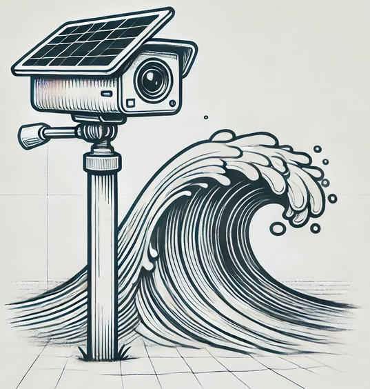

+++
title = "My first post using hugo!"
date = "2024-12-13T17:32:13Z"
tags = [thoughts]
+++

## Thoughts on making a remote surf monitoring camera

I live in Ireland and have spent many years surfing on the west coast of Ireland. The quality of the waves can vary drastically across a short stretch of coastline as some spots are better sheltered, some are more sheltered or less sheltered etc.

Whatsapp groups have sprung up where surfers will post videos of local surf spots which let other surfers in the area know where the best waves are to be had that day.

One of these groups is called "Westcoast surf conditions" and at the time of writing, it has 483 members. Considering it has grown via word of mouth this is a decent size. There are many other such groups on whatsapp and facebook.

This brings me onto the next part of this which is surf webcams. These are popular all over the world wherever there are popular surf spots. The issue is you can only really have a webcam if there are buildings of some kind with a view of the waves. Surf schools in particular are incentivised to mount a surf camera as it drives traffic to their website and also attracts potential customers to their beach.

There is a gap in the "surfer attention marketplace" of remote surf spots where a surf webcam cannot easily be installed. This led me down a bit of a rabbit hole thinking about how I would go about making something like this.

Some of the main challenges I identified:

- The tide! It is likely not possible to just permanently mount a camera pointing towards the waves. Given tidal swings, the camera may need to be able to "look" at where the waves are breaking
- Rain. How will the camera lens of front window be affected by rain and raindrops
- Power. The camera likely will be unable to be always on. How could I make it so that a user could remotely wake up the camera?

